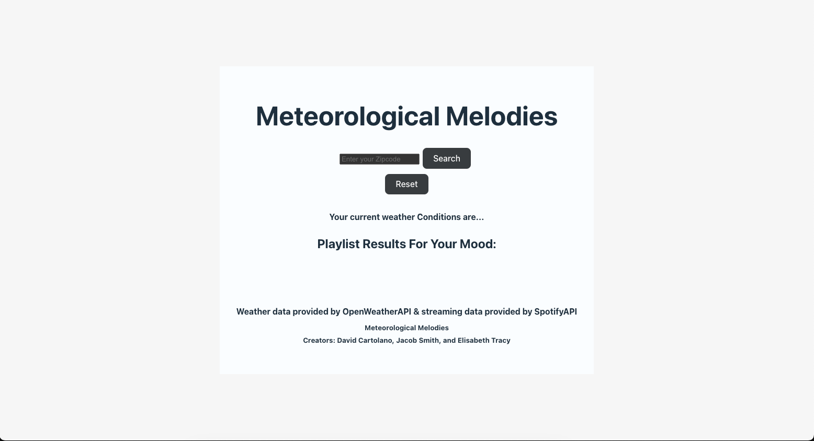
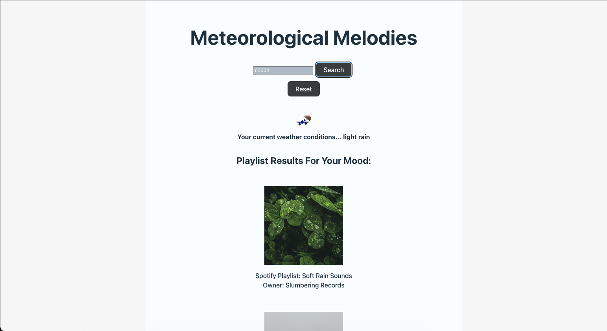
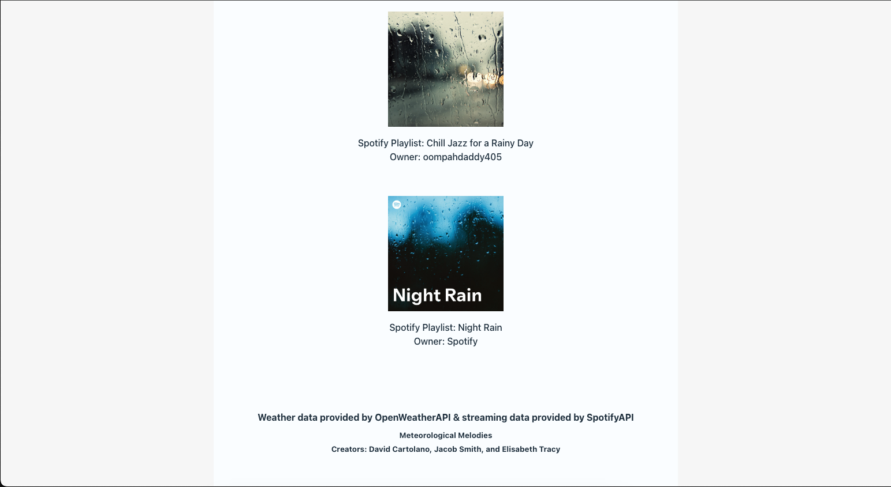

# Project 2: Meteorological Melodies

A Web App that will help you find music to match the weather.

# Table of Contents

- [Preview](#preview)
- [Demo](#demo)
- [Introduction](#introduction)
- [Installation](#installation)
- [Description](#description)
- [Usage](#usage)
- [Credits](#credits)
- [License](#license)

## Preview

## Demo

[Click here](https://drive.google.com/file/d/1y_nBHxs8-s0LAGZi4JlXFKtbIZWdEark/view) to view video demo.

## Introduction

Many people enjoy listening to music throughout their day, and often for a wide variety of reasons- but maybe one of the most common reasons is music’s ability to influence our mood. Music can carry a strong emotional connection, one that can energize and lift us up at times, or at other times can calm us down and help us relax, to name just a few. Something else that also carries a strong emotional connection for most people is the weather. From the warmth and excitement of a bright, sunny summer day, all the way to the mellow chill of a cloudy winter flurry, it makes sense that we might often find ourselves wanting music that doesn’t clash with the vibe nature’s already created for us.

## Installation

- fork repository, git clone "SSH KEY", npm run i, npm run build, npm run start:dev
- create a copy of env.example and populate with your own keys
- create a pgAdmin database named "locations_db" and change db_password in env to your pgAdmin password

## Description

As fellow music enthusiasts we wanted to be able to enter our location and find our current weather conditions, while also finding music that will go well with them. 

The goal was to create a single web app that found music that would relate to the user's mood based on the weather they currently are having.

When the user submits their zipcode, we present the Spotify playlists in a neat and organized manner. Our Spotify playlist cards are completely interactable - the image and playlist name send you to the playlist, while the owner name sends you to the playlist owner's spotify page where you can find similar playlists if you liked the one that we suggested. Through this process, we used and became more proficient integrating external API data, hiding sensitive/secret keywords, designing servers & databases, creating & structuring routes, and populating & styling the front-end.

## Usage

Usage of this site is simple - enter your current zipcode, and recieve a list of interactable Spotify playlists that match your mood/weather. To contact us, click on our interactable names at the footer of the page, they will bring you to the intended github page.

## Credits

Collaborators included: David Cartolano, Jacob Smith and Elisabeth Tracy

[OpenWeatherAPI](https://openweathermap.org/)

[SpotifyAPI for Devs](https://developer.spotify.com/documentation/web-api)

## License

N/A